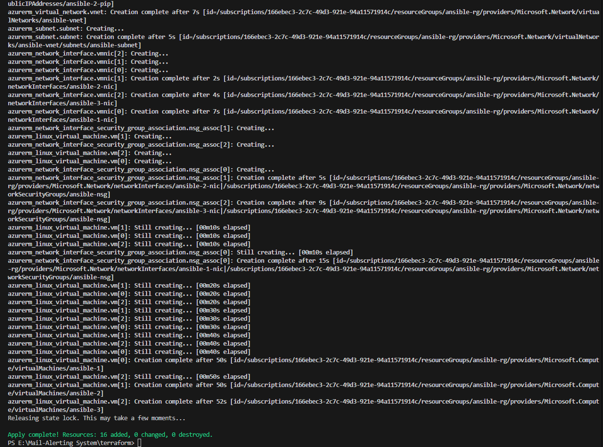
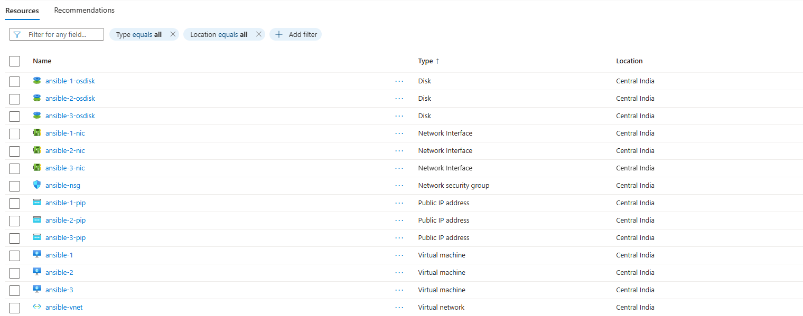
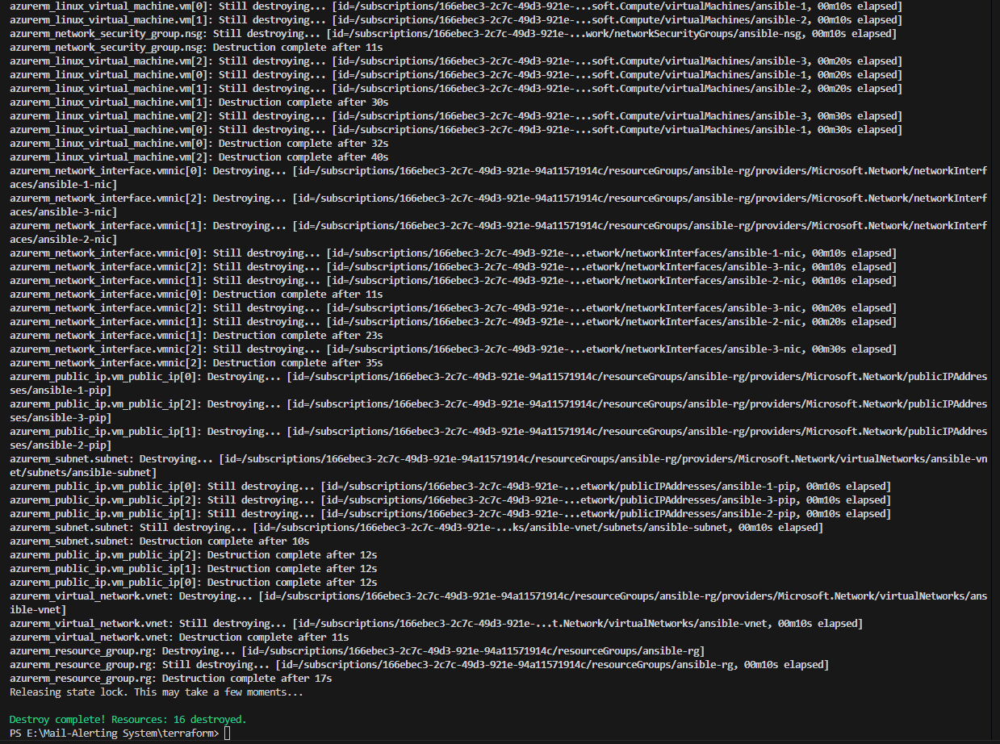
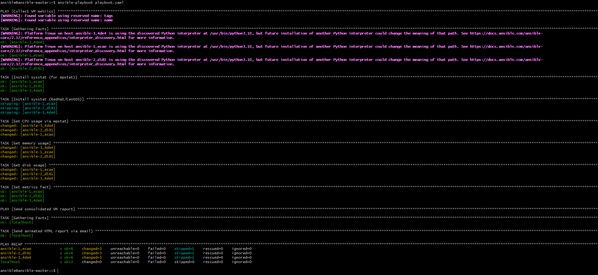
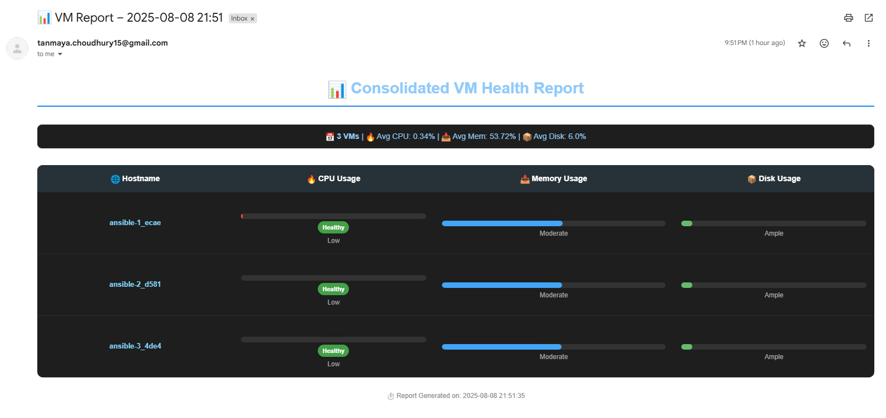

# Mail-Alerting System for Azure VMs

This project demonstrates automated provisioning and monitoring of Azure Virtual Machines using Terraform and Ansible, with email-based reporting.

## Overview

- **Terraform** scripts define and deploy Azure infrastructure, including resource groups, networks, security groups, and multiple Linux VMs.
- Each VM is initialized with a custom user (`ansible`), password authentication, sudo privileges, and an SSH public key.
- **Ansible** playbooks connect to the VMs, collect system metrics (CPU, memory, disk usage), and generate an animated HTML report.
- The report is sent via email to a configured recipient, summarizing the health and status of all managed VMs.

## Structure

- `terraform/` contains all infrastructure-as-code files for Azure deployment.
- `ansible/` includes playbooks for metric collection and email reporting, configuration files, and Jinja2 templates for HTML emails.

## Key Files

- **Terraform:**  
  - `main.tf`, `variable.tf`, `provider.tf`, `backend.tf` — define resources and variables.
  - `id_ed25519.pub` or `linux_key.pem` — SSH public key for VM access.
- **Ansible:**  
  - `playbook.yaml` — main playbook for orchestrating tasks.
  - `collect_metrics.yaml` — gathers VM metrics.
  - `send_report.yaml` — sends the HTML report via email.
  - `group_vars/all.yaml` — stores group-wide variables, including SMTP settings.
  - `templates/report_email_animated.html.j2` — Jinja2 template for the animated HTML report.
  - `myazure_rm.yml` — dynamic inventory file for Azure VMs.

## Workflow

1. **Provisioning:**  
   Terraform scripts create the Azure environment and VMs, configuring each VM for SSH and password access.
2. **Monitoring:**  
   Ansible connects to each VM using the dynamic inventory, collects system metrics, and stores results.
3. **Reporting:**  
   Ansible renders the metrics into an animated HTML email and sends it to the specified address.

## Example Output & Screenshots

- **Creating Infrastructure:**  
  
- **Resources Overview:**  
  
- **Destroying Infrastructure:**  
  
- **Running Ansible Playbook:**  
  
- **Email Result:**  
  

## Technologies Used

- Terraform (Azure provider)
- Ansible